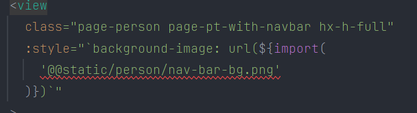

### node
node >=16.14.x   
pnpm >=8.x

### css
项目使用 scss + tailwind

### git
1. git commit 遵守 Angular 提出的规范. [详情](./.commitlintrc.js)   
eg: fix: xxxx
2. git commit 之前会做 eslint + stylelint 校验及格式化.

### component
1. uni-ui 使用 npm + easycom 方式自动注册组件，页面可以直接使用 kebab-case 的形式    
eg: <uni-badge />
2. 自定义组件放在 components 文件夹下都以 pro- 开头，且要符合 [easycom](./src/pages.json) 的方式,无需引入可直接使用   
eg: <pro-text />

### unit
基准宽度为 750, 目前设计稿宽度为 375.内部已经做了转换，可直接用 px 单位，会自动转为 rpx, 若不想转为 rpx，使用大写px（PX）

### 图片和背景图
1. 图片引入写法：
2. 背景图请使用 background-image 写在 style 中：

### 手机预览和调试
请关闭电脑的防火墙

[常见问题](./docs/FAQ.md)   

